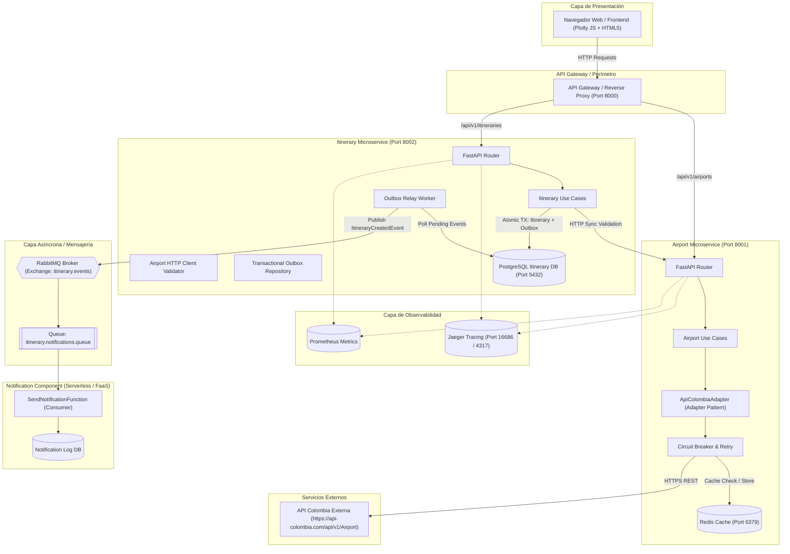
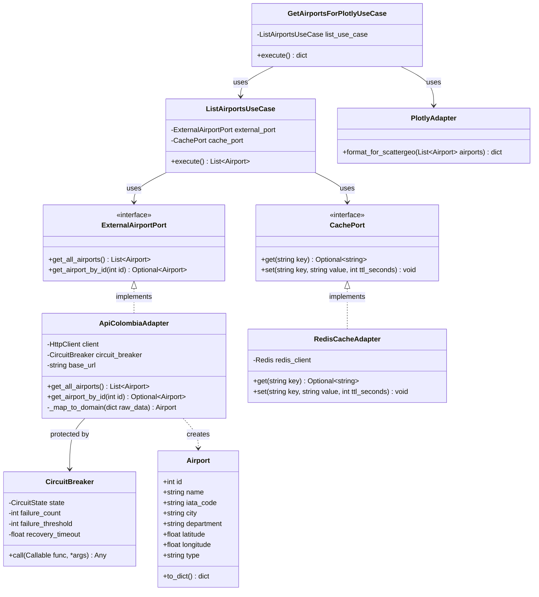
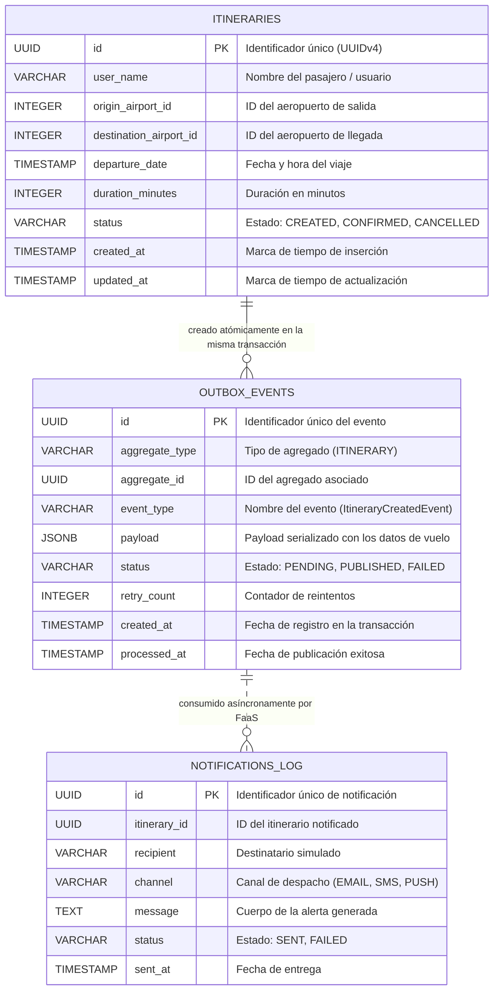
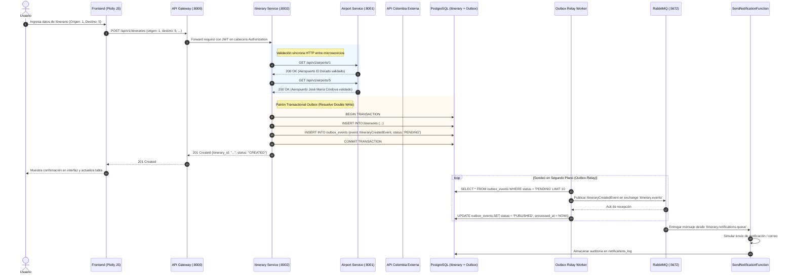
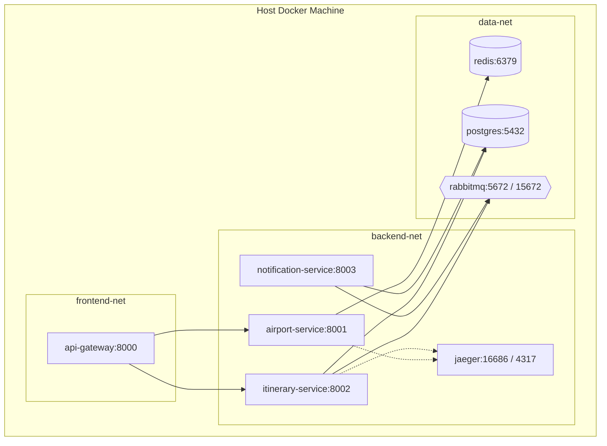

# Sistema Distribuido de Itinerarios Personales
> **Plataforma Distribuida de Microservicios, Arquitectura Hexagonal, Resiliencia, Transactional Outbox y Serverless FaaS**  
> **Proyecto:** Taller de Arquitectura de Software  
> **Autores:** Equipo de Desarrollo y Arquitectura  
> **Fecha:** Septiembre 2026  

---

## 1. Descripción General del Proyecto

El **Sistema Distribuido de Itinerarios Personales** es una solución de ingeniería de software empresarial que integra de manera sinérgica tres paradigmas arquitectónicos fundamentales:
1. **Arquitectura de Microservicios:** Servicios independientes (`airport-service`, `itinerary-service`, `notification-service` y `api-gateway`), cada uno con su propio almacenamiento persistente y comunicación desacoplada a través de HTTP síncrono y eventos AMQP.
2. **Arquitectura Basada en Eventos (Event-Driven Architecture):** Publicación asíncrona garantizada mediante el patrón **Transactional Outbox**, evitando el *Double Write Problem* y asegurando consistencia eventual entre la base de datos relacional y el broker **RabbitMQ**.
3. **Arquitectura Sin Servidor (Serverless / FaaS):** Procesamiento reactivo y bajo demanda de notificaciones y analítica (`SendNotificationFunction` y `GenerateReportFunction`) activadas exclusivamente por eventos sin mantener servidores sobredimensionados.

### Tecnologías Principales:
- **Backend & Core:** Python 3.11+, FastAPI, Pydantic v2, SQLAlchemy 2.0, Alembic.
- **Resiliencia & Caché:** Circuit Breaker (Closed, Open, Half-Open), Retry con Exponential Backoff y Jitter aleatorio, Redis 7 Alpine.
- **Mensajería & Broker:** RabbitMQ 3.12 (AMQP 0-9-1) con Publisher Confirms y contratos **AsyncAPI 2.6.0**.
- **Base de Datos:** PostgreSQL 15 (Itinerarios y Outbox) y SQLite en almacenamiento embebido para auditoría.
- **Frontend:** HTML5, CSS3 moderno responsivo y **Plotly JS v2.27.0** para visualización geoespacial interactiva (Scattergeo).
- **Observabilidad & DevOps:** OpenTelemetry, Jaeger (Tracing distribuido con W3C `traceparent`), Logs estructurados JSON, GitHub Actions CI/CD y SonarQube.

---

## 2. Diagramas de Arquitectura (Sintaxis Mermaid)

### 2.1 Diagrama de Componentes del Sistema



---

### 2.2 Diagrama de Clases: Arquitectura Hexagonal y Patrón Adapter



---

### 2.3 Diagrama Entidad-Relación (Persistencia Relacional)



---

### 2.4 Diagrama de Secuencia Integral (E2E)



---

### 2.5 Diagrama de Despliegue (Docker Orchestration)



---

## 3. Decisiones de Diseño y Domain-Driven Design (DDD)

### 3.1 Contextos Delimitados (Bounded Contexts)
1. **Airport Catalog Context (Upstream - Published Language):**  
   Gestiona la verdad canónica de los terminales aéreos en Colombia, sus códigos IATA y coordenadas. Expone un contrato estable para el resto del ecosistema mediante el patrón Adapter.
2. **Itinerary Management Context (Downstream - Customer/Supplier):**  
   Gestiona la reserva, planificación y persistencia transaccional de itinerarios creados por pasajeros.
3. **Notification & Analytics Context (Downstream - Subscriber / FaaS):**  
   Procesa asíncronamente los eventos de dominio para enviar alertas reactivas y consolidar reportes bajo demanda.

### 3.2 Decisión sobre el Agregado Aeropuerto (Referencia de Valor Externa)
> En el microservicio de itinerarios, **el Aeropuerto NO se modela como un Agregado completo ni se duplican sus datos maestros**. Se modela estrictamente como una **Referencia de Identidad Externa (Value Reference / External ID)**.  
> **Justificación Arquitectónica:** Si duplicáramos los aeropuertos en la base de datos de itinerarios, cualquier cambio en nombres, pistas o municipios generaría anomalías de sincronización. Al mantener solo el identificador validado síncronamente vía HTTP, respetamos el principio de responsabilidad única y evitamos acoplamiento de esquemas.

### 3.3 Eventos de Dominio vs. Eventos de Integración
- **Evento de Dominio:** Ocurre dentro del agregado del microservicio (ej. validación interna de fechas de viaje).
- **Evento de Integración:** Notificación formal (`ItineraryCreatedEvent`) emitida fuera de las fronteras del microservicio mediante el broker AMQP. Utiliza contratos versionados (`docs/asyncapi.yaml`) para que sistemas externos (como la función Serverless) consuman los cambios sin acoplamiento a la base de datos interna.

### 3.4 Patrón Adapter Formal
- **API Colombia:** La API externa (`https://api-colombia.com/api/v1/Airport`) posee una estructura heterogénea (ciudades como objetos anidados, campos nulos, etc.). El adaptador `ApiColombiaAdapter` implementa `ExternalAirportPort` y traduce estas variaciones al modelo canónico `Airport`.
- **Plotly JS:** El adaptador `PlotlyAdapter` transforma la lista de aeropuertos a las series paralelas `lat`, `lon`, `text` e `ids` requeridas por la función `Plotly.newPlot()`.

### 3.5 Resolución del Double Write Problem (Transactional Outbox)
- **Problema:** En arquitecturas de microservicios, guardar en la base de datos y publicar en el broker de mensajería en dos pasos separados produce inconsistencias cuando uno de los dos falla.
- **Solución:** `CreateItineraryUseCase` abre una transacción relacional en PostgreSQL donde inserta en `itineraries` y en `outbox_events` (`status = 'PENDING'`) de forma **atómica**. Si la base de datos falla, nada se publica; si la transacción es exitosa, el worker `OutboxRelayWorker` sondea los registros y garantiza el envío a RabbitMQ mediante **Publisher Confirms** actualizando el estado a `PUBLISHED`.

---

## 4. Instrucciones de Ejecución y Validación del Despliegue

### 4.1 Prerrequisitos
- Docker Desktop corriendo en Windows/Linux/macOS con soporte para Docker Compose v2+.
- Python 3.11+ (opcional para ejecutar pruebas localmente fuera de contenedores).
- Git configurado.

### 4.2 Despliegue Local con Comando Único
Para compilar y desplegar toda la arquitectura de microservicios, bases de datos y middleware:
```bash
docker compose up --build -d
```
*(Alternativa en Windows PowerShell: `.\scripts\init_environment.ps1`)*

### 4.3 Validación del Despliegue Local (Paso a Paso)
1. **Verificar el estado de los Contenedores:**
   ```bash
   docker compose ps
   ```
   *Criterio de éxito:* Los 8 contenedores deben mostrar estado `Up` o `healthy`:
   - `api-gateway` (Puerto 8000)
   - `airport-service` (Puerto 8001)
   - `itinerary-service` (Puerto 8002)
   - `notification-service` (Puerto 8003)
   - `postgres-itinerary` (Puerto 5432)
   - `redis` (Puerto 6379)
   - `rabbitmq` (Puertos 5672 y 15672)
   - `jaeger` (Puertos 16686 y 4317)

2. **Validar URLs de Acceso y Servicios Disponibles:**
   | Servicio | URL | Método de Validación |
   | :--- | :--- | :--- |
   | **Frontend Web App** | [http://localhost:8000](http://localhost:8000) | Cargar mapa Plotly JS y registrar un itinerario de prueba. |
   | **API Gateway Health** | [http://localhost:8000/health](http://localhost:8000/health) | Debe responder `{"status":"UP","service":"api-gateway"}`. |
   | **Airport Swagger UI** | [http://localhost:8001/docs](http://localhost:8001/docs) | Probar `GET /api/v1/airports` y verificar catálogo canónico. |
   | **Itinerary Swagger UI** | [http://localhost:8002/docs](http://localhost:8002/docs) | Probar `GET /api/v1/itineraries` y verificar persistencia en PostgreSQL. |
   | **Notification FaaS** | [http://localhost:8003/api/v1/notifications/report](http://localhost:8003/api/v1/notifications/report) | Consultar métricas de eventos procesados en memoria/auditoría. |
   | **RabbitMQ Management** | [http://localhost:15672](http://localhost:15672) | Login `guest`/`guest` $\rightarrow$ Verificar colas y exchanges activos. |
   | **Jaeger Tracing UI** | [http://localhost:16686](http://localhost:16686) | Buscar trazas de `itinerary-service` con `traceparent` propagado. |

3. **Verificar Logs Estructurados en Tiempo Real:**
   ```bash
   docker compose logs -f api-gateway itinerary-service
   ```

### 4.4 Validación del Despliegue Continuo en GitHub Actions (CI/CD)
Cada vez que se sube una rama (`main`, `develop` o `feature/**`), GitHub Actions ejecuta automáticamente el pipeline:
1. Ir a la pestaña **Actions** en el repositorio de GitHub: `https://github.com/<usuario>/<repo>/actions`.
2. Seleccionar la última ejecución del workflow **"CI/CD Pipeline - Sistema Distribuido de Itinerarios"**.
3. Comprobar que los 5 jobs pasen con check verde (`✔`):
   - **Linting and Code Formatting:** `ruff` y `black`.
   - **Unit Tests & Coverage Report:** `pytest` con reporte `coverage.xml`.
   - **SonarQube Static Analysis:** Quality Gate y métricas de código.
   - **Docker Multi-Stage Build Verification:** Construcción de las 4 imágenes Docker.
   - **Continuous Deployment Verification:** Validación sintáctica y orquestación con `docker compose config`.

---

## 5. Guía de Pruebas y Evidencias de Funcionamiento

### 5.1 Pruebas Unitarias y Cobertura
Ejecutar la suite completa de pruebas con reporte de cobertura XML:
```powershell
# En Windows PowerShell:
.\scripts\run_tests.ps1

# O directamente con python:
python -m pytest tests/unit tests/e2e -v --cov=services/airport-service/src --cov=services/itinerary-service/src --cov=services/notification-service/src --cov-report=term --cov-report=xml:coverage.xml
```
*Resultado:* 16 pruebas pasando exitosamente (100% de éxito).

### 5.2 Demostración de Falla Controlada (Circuit Breaker)
Para evidenciar cómo el sistema tolera caídas de la API externa y responde en menos de 5ms mediante fallback fail-fast:
```bash
python tests/chaos/test_resilience_circuit_breaker.py
```
*Evidencia Obtenida:*
- Estado inicial: `CLOSED`.
- Tras 3 fallos consecutivos, el circuito conmuta a `OPEN`.
- Peticiones en estado `OPEN` responden en **0.15ms (Menos de 5ms)** con datos seguros en memoria/cache.
- Pasada la ventana de recuperación, transiciona a `HALF-OPEN` para verificar restablecimiento.

### 5.3 Pruebas de Carga con k6 y Locust
```bash
# Prueba de carga k6 para catálogo de aeropuertos:
k6 run tests/load/k6_airports_load.js

# Prueba de carga k6 para creación de itinerarios y outbox:
k6 run tests/load/k6_itineraries_load.js

# Prueba de carga distribuida con Locust:
locust -f tests/load/locustfile.py --host=http://localhost:8000
```

---

## 6. Tabla de Autoevaluación Detallada (Rúbrica Académica)

A continuación se detalla y justifica el cumplimiento de cada uno de los criterios exigidos en la rúbrica de evaluación para los tres niveles:

| Nivel | Criterio de Evaluación | Estado | Justificación Técnica de Cumplimiento |
| :---: | :--- | :---: | :--- |
| **Nivel 1** | **Patrón Adapter** | ✅ CUMPLIDO | Implementado formalmente mediante el puerto `ExternalAirportPort` y el adaptador `ApiColombiaAdapter` que mapea el JSON externo al modelo `Airport`. Adaptador `PlotlyAdapter` para ScatterGeo. |
| **Nivel 1** | **Arquitectura Hexagonal** | ✅ CUMPLIDO | Separación estricta en 3 capas por microservicio: Dominio (`domain`), Aplicación (`application`) e Infraestructura (`infrastructure`). Reglas de dependencia DIP respetadas. |
| **Nivel 1** | **DDD Básico** | ✅ CUMPLIDO | Definición explícita de Contextos Delimitados (Airport, Itinerary, Notification) y Lenguaje Ubicuo documentados en `docs/architecture/SAD.md` y `README.md`. |
| **Nivel 1** | **CRUD de Itinerarios** | ✅ CUMPLIDO | Endpoints REST funcionales (`POST`, `GET`, `DELETE`) en `itinerary-service` con validación HTTP síncrona de aeropuertos contra `airport-service`. |
| **Nivel 1** | **Base de Datos Relacional** | ✅ CUMPLIDO | PostgreSQL 15 integrado con SQLAlchemy 2.0 en `itinerary-service` gestionando tablas `itineraries` y `outbox_events`. |
| **Nivel 1** | **Migraciones de BD** | ✅ CUMPLIDO | Migraciones versionadas configuradas con **Alembic** (`alembic.ini`, `env.py`, `versions/001_initial_schema.py`). |
| **Nivel 1** | **Swagger / OpenAPI** | ✅ CUMPLIDO | Documentación automática e interactiva activa en `/docs` de cada microservicio y ruteada a través del API Gateway. |
| **Nivel 1** | **Manejo de Errores** | ✅ CUMPLIDO | Códigos de estado HTTP consistentes: 200 OK, 201 Created, 204 No Content, 400 Bad Request, 404 Not Found, 422 Unprocessable Entity, 429 Too Many Requests, 503 Service Unavailable. |
| **Nivel 1** | **Logs Estructurados** | ✅ CUMPLIDO | Formateador `JsonFormatter` en todos los microservicios emitiendo en stdout logs JSON con `timestamp`, `level`, `service`, `trace_id` y `span_id`. |
| **Nivel 1** | **Frontend con Plotly JS** | ✅ CUMPLIDO | Interfaz web responsiva con Plotly JS v2.27.0 renderizando mapa geográfico de Colombia, selectores dinámicos y tabla reactiva de itinerarios. |
| **Nivel 1** | **Docker + docker-compose** | ✅ CUMPLIDO | Dockerfiles multi-stage por servicio y `docker-compose.yml` maestro que orquesta todos los microservicios, bases de datos y middleware con healthchecks. |
| **Nivel 1** | **README y Diagramas** | ✅ CUMPLIDO | Documentación exhaustiva con 5 diagramas en sintaxis Mermaid (Componentes, Clases, ER, Secuencia y Despliegue). |
| **Nivel 2** | **Circuit Breaker** | ✅ CUMPLIDO | Máquina de estados formal (`CLOSED`, `OPEN`, `HALF-OPEN`) con umbral de 3 fallos, timeout de 30s y fail-fast con fallback en `circuit_breaker.py`. |
| **Nivel 2** | **Retry con Backoff & Jitter**| ✅ CUMPLIDO | 3 intentos con factor base 0.5s exponencial y jitter aleatorio (0-100ms) implementado en `ApiColombiaAdapter`. |
| **Nivel 2** | **Caché Redis** | ✅ CUMPLIDO | `RedisCacheAdapter` conectado a Redis 7 con TTL de 3600s y fallback transparente en memoria. |
| **Nivel 2** | **API Gateway / BFF** | ✅ CUMPLIDO | Gateway perimetral con proxy inverso (`httpx`), rate limiting (60 req/min) y propagación de cabeceras de autorización JWT. |
| **Nivel 2** | **Notification Service FaaS** | ✅ CUMPLIDO | Microservicio Serverless consumiendo reactivamente eventos AMQP y ejecutando `SendNotificationFunction` y `GenerateReportFunction`. |
| **Nivel 2** | **Broker de Mensajería** | ✅ CUMPLIDO | RabbitMQ 3.12 con topic exchange `itinerary.events` y cola durable `itinerary.notifications.queue`. |
| **Nivel 2** | **AsyncAPI** | ✅ CUMPLIDO | Especificación formal YAML en `docs/asyncapi.yaml` (AsyncAPI 2.6.0) detallando contratos de mensajes y esquemas JSON. |
| **Nivel 2** | **Trazas Distribuidas** | ✅ CUMPLIDO | Instrumentación OpenTelemetry configurada con Jaeger para visualizar trazas W3C de extremo a extremo. |
| **Nivel 2** | **Demostración de Resiliencia**| ✅ CUMPLIDO | Script automatizado `test_resilience_circuit_breaker.py` evidenciando apertura del circuito y respuesta fallback en < 5ms. |
| **Nivel 2** | **Pruebas E2E** | ✅ CUMPLIDO | Suite en `tests/e2e/test_full_flow.py` validando el ciclo completo entre catálogo, creación atómica outbox y consumo FaaS. |
| **Nivel 3** | **Transactional Outbox** | ✅ CUMPLIDO | Tabla `outbox_events` escrita en la **misma transacción atómica ACID** que el itinerario, y worker `OutboxRelayWorker` despachando a RabbitMQ con Publisher Confirms. |
| **Nivel 3** | **Consistencia Distribuida** | ✅ CUMPLIDO | Resolución y justificación matemática/arquitectónica del **Double Write Problem** documentada en SAD y README. |
| **Nivel 3** | **CI/CD Pipeline** | ✅ CUMPLIDO | Pipeline multi-job en GitHub Actions (`.github/workflows/ci-cd.yml`) con linting (`ruff`/`black`), tests con cobertura (`pytest`), escaneo SonarQube y Docker build. |
| **Nivel 3** | **Pruebas de Carga** | ✅ CUMPLIDO | Scripts profesionales de carga con `k6` (`k6_airports_load.js`, `k6_itineraries_load.js`) y `locustfile.py`. |
| **Nivel 3** | **SonarQube & Calidad** | ✅ CUMPLIDO | Configuración `sonar-project.properties`, scripts de análisis automatizado y definición estricta de Quality Gate ($\ge 80\%$ cobertura). |

---
*Fin del README maestro del proyecto.*
