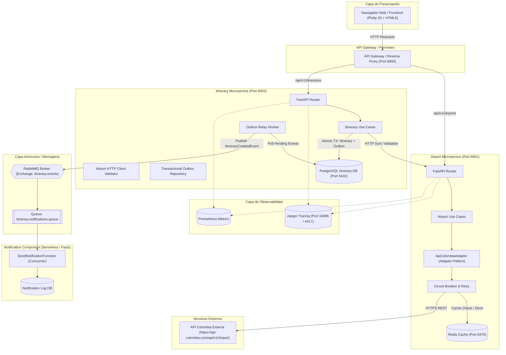
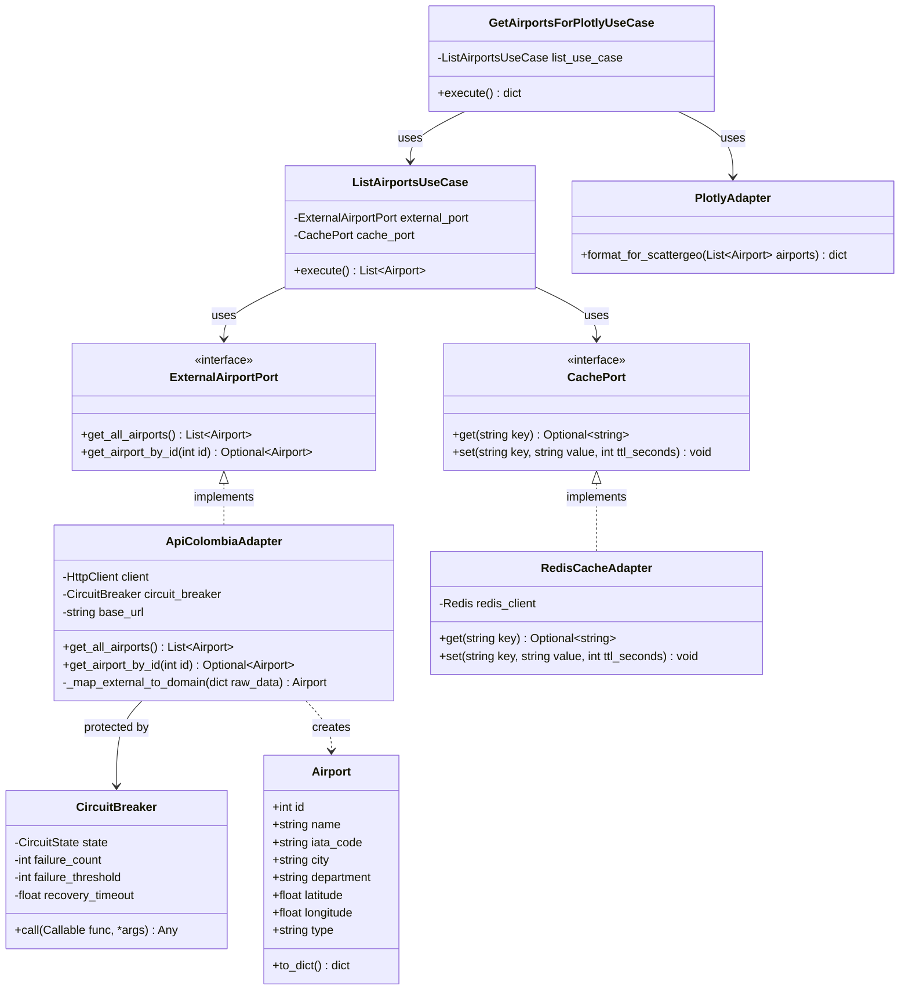
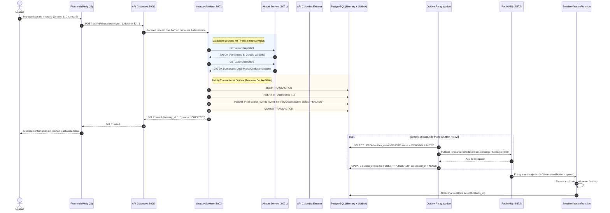
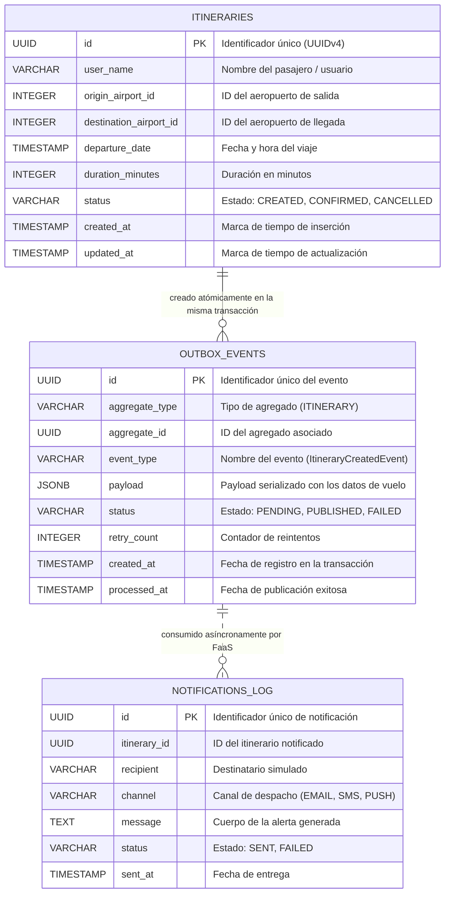
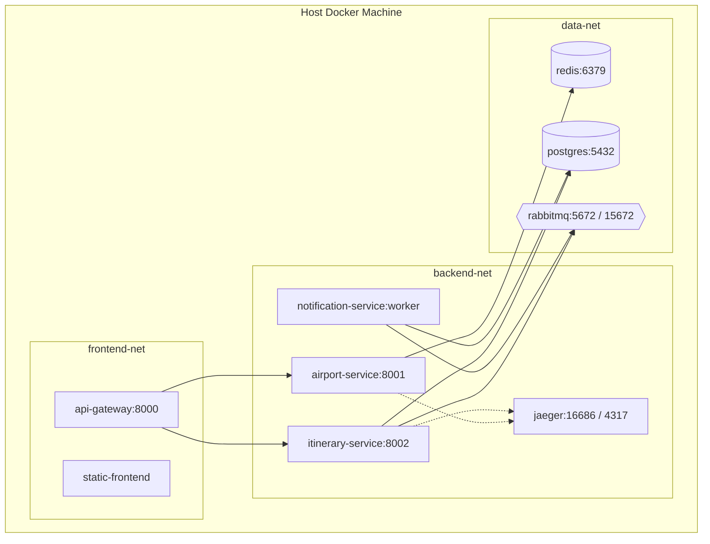

# Software Architecture Document (SAD)
## Sistema Distribuido de Itinerarios Personales

**Proyecto:** Taller de Arquitectura de Software  
**Versión:** 1.0.0  
**Fecha:** Septiembre 2026  
**Autores:** Equipo de Desarrollo y Arquitectura  
**Estado:** Aprobado  

---

## 1. Introducción y Objetivos Arquitectónicos

### 1.1 Propósito
El presente documento describe la arquitectura global del **Sistema Distribuido de Itinerarios Personales**. Este sistema permite a los usuarios consultar aeropuertos colombianos en tiempo real, visualizar su distribución geográfica mediante mapas interactivos, y planificar itinerarios de viaje garantizando validaciones síncronas entre servicios y procesamiento asíncrono reactivo bajo el paradigma Serverless (FaaS).

### 1.2 Alcance del Sistema
El sistema comprende tres microservicios principales, un API Gateway perimetral, una base de datos relacional dedicada, cache en memoria, un broker de mensajería AMQP, un componente de observabilidad distribuida y una interfaz de usuario moderna:
1. **API Gateway (BFF):** Punto único de entrada, control de flujo (rate limiting), ruteo y propagación de cabeceras de seguridad JWT.
2. **Airport Service:** Servicio desacoplado mediante Arquitectura Hexagonal y Patrón Adapter que consume la API pública externa de API Colombia, integrando resiliencia (Circuit Breaker y Retry con jitter) y cache Redis.
3. **Itinerary Service:** Servicio transaccional que gestiona el ciclo de vida de los itinerarios, valida la existencia de aeropuertos contra el Airport Service y garantiza la consistencia eventual mediante el patrón **Transactional Outbox** para evitar el *Double Write Problem*.
4. **Notification Service (Serverless / FaaS):** Función efímera reactiva (`SendNotificationFunction`) activada exclusivamente por eventos `ItineraryCreatedEvent` desde RabbitMQ, persistiendo el registro de auditoría en base de datos.
5. **Frontend Web:** Interfaz ligera basada en HTML5/CSS3 y Plotly JS para visualización cartográfica y gestión interactiva de itinerarios.

### 1.3 Objetivos de Calidad (Atributos de Arquitectura)
- **Desacoplamiento:** Cada microservicio posee su propia persistencia y lógica de dominio aislada de tecnologías de infraestructura (Arquitectura Hexagonal / Puertos y Adaptadores).
- **Resiliencia y Tolerancia a Fallas:** Protección ante degradación o indisponibilidad de proveedores externos mediante Circuit Breaker de 3 estados, reintentos exponenciales con jitter y respuestas degradadas seguras.
- **Consistencia de Datos:** Eliminación del problema de doble escritura (*Double Write Problem*) en la integración entre base de datos relacional y broker de eventos mediante el patrón Transactional Outbox.
- **Observabilidad:** Trazabilidad de extremo a extremo con OpenTelemetry y Jaeger, correlacionando trazas distribuidas con logs estructurados en JSON (`trace_id`, `span_id`).
- **Escalabilidad y Elasticidad:** Separación de cargas de trabajo transaccionales (HTTP) y asíncronas/Serverless (FaaS guiado por eventos).

---

## 2. Vista Lógica (Modelo 4+1)

### 2.1 Diagrama de Componentes del Sistema



### 2.2 Diseño de Dominio Guiado por el Dominio (DDD)

#### Contextos Delimitados (Bounded Contexts)
1. **Airport Catalog Context (Upstream - Published Language):**
   - **Responsabilidad:** Gestionar el catálogo canónico de terminales aeroportuarios de Colombia, su geolocalización y adaptación gráfica.
   - **Entidades:** `Airport` (Entidad de dominio con id, nombre, código IATA, ciudad, departamento y coordenadas).
   - **Puertos:** `ExternalAirportPort` (obtención remota), `CachePort` (almacenamiento en caché).

2. **Itinerary Management Context (Downstream - Customer/Supplier):**
   - **Responsabilidad:** Gestión del ciclo de vida de los itinerarios de viaje solicitados por los usuarios y coordinación de eventos de integración.
   - **Agregado Raíz:** `Itinerary`.
   - **Entidades y Value Objects:** `TravelDate`, `FlightDuration`, `AirportReference` (Value Object).
   - **Decisión de Agregado:** En este contexto, el aeropuerto **no se duplica como agregado completo**, sino como una **Referencia de Identidad Externa (Value Reference)** validada contra el Airport Service. Esto previene acoplamiento y redundancia de datos maestros.

3. **Notification Context (Downstream - Subscriber):**
   - **Responsabilidad:** Procesamiento reactivo Serverless de alertas y registro de auditoría de confirmaciones de viaje.
   - **Entidades:** `NotificationLog`.

#### Lenguaje Ubicuo (Ubiquitous Language)
| Término | Definición en el Sistema |
| :--- | :--- |
| **Itinerario (Itinerary)** | Plan de vuelo programado por un usuario que conecta un aeropuerto de origen con uno de destino en una fecha y duración determinadas. |
| **Aeropuerto (Airport)** | Terminal aéreo oficial validado con código IATA y coordenadas de geolocalización. |
| **Buzón de Salida (Outbox)** | Registro atómico de eventos pendientes por publicar en el broker de mensajería dentro de la misma transacción relacional del itinerario. |
| **Evento de Integración** | Mensaje de dominio serializado (`ItineraryCreatedEvent`) destinado a comunicar cambios de estado a otros sistemas a través del broker. |
| **Función Serverless** | Unidad de ejecución efímera que atiende un evento específico y se apaga tras concluir la tarea. |

### 2.3 Diagrama de Clases: Arquitectura Hexagonal y Patrón Adapter



---

## 3. Vista de Procesos (Flujo de Ejecución)

### 3.1 Diagrama de Secuencia Integral



---

## 4. Vista de Datos (Persistencia Relacional)

### 4.1 Diagrama Entidad-Relación



---

## 5. Vista de Desarrollo y Estructura Hexagonal

Cada microservicio implementa la Arquitectura Hexagonal en tres capas estrictas:
```text
services/<nombre-servicio>/
├── src/
│   ├── domain/               # NÚCLEO: Entidades puras y puertos (interfaces abstractas)
│   │   ├── models/           # Modelos de dominio
│   │   └── ports/            # Interfaces de puertos primarios y secundarios
│   ├── application/          # CASOS DE USO: Orquestación de lógica de negocio
│   │   └── use_cases/
│   └── infrastructure/       # ADAPTADORES: Implementaciones concretas
│       ├── adapters/         # Clientes externos, repositorios, circuitos
│       ├── api/              # Controladores REST FastAPI, routers y esquemas
│       └── config.py         # Variables de entorno y configuración
├── tests/                    # Pruebas unitarias y de integración
├── Dockerfile                # Empaquetamiento multi-stage
└── requirements.txt
```

### Reglas de Dependencia:
- La capa de **Dominio** no depende de ningún framework externo (ni FastAPI, ni SQLAlchemy, ni Redis).
- La capa de **Aplicación** solo conoce al Dominio y a las interfaces abstractas de los Puertos.
- La capa de **Infraestructura** implementa los Puertos y depende de bibliotecas de terceros (`httpx`, `sqlalchemy`, `redis`, `pika`).

---

## 6. Vista Física y de Despliegue



---

## 7. Patrones Arquitectónicos y Solución a Problemas Críticos

### 7.1 Patrón Adapter Formal (API Colombia & Plotly)
- **Problema:** La API pública `https://api-colombia.com/api/v1/Airport` posee esquemas externos sujetos a cambios, estructuras anidadas y nombres de atributos heterogéneos. Además, la librería gráfica Plotly JS exige arreglos paralelos de latitudes, longitudes y textos.
- **Solución:** Se definió el puerto abstracto `ExternalAirportPort`. El adaptador `ApiColombiaAdapter` implementa este puerto, realizando el consumo HTTP, manejo de fallos y mapeo hacia la entidad de dominio `Airport`. Adicionalmente, el `PlotlyAdapter` transforma la lista de aeropuertos de dominio al formato ScatterGeo.

### 7.2 Patrón Circuit Breaker & Retry con Backoff Exponencial y Jitter
- **Problema:** Fallas de red o indisponibilidad en API Colombia pueden ocasionar cascading failures y bloqueo de conexiones.
- **Solución:** Máquina de estados con 3 fases:
  - `CLOSED`: Peticiones normales. Monitorea fallas.
  - `OPEN`: Tras 3 fallos consecutivos o timeouts, el circuito se abre por 30 segundos, devolviendo de inmediato fallback/cache sin degradar la red.
  - `HALF-OPEN`: Pasados los 30 segundos, permite 1 petición exploratoria. Si es exitosa, se restablece a `CLOSED`; si falla, regresa a `OPEN`.
  - Reintentos con factor exponencial $t = 0.5 \times 2^{retry} + \text{jitter}$.

### 7.3 Patrón Transactional Outbox (Resolución del Double Write Problem)
- **Problema:** Escribir en base de datos relacional y publicar en RabbitMQ en operaciones separadas produce inconsistencia si el broker se cae tras el commit o si el commit falla tras publicar el mensaje.
- **Solución:** El caso de uso inserta simultáneamente en `itineraries` y en `outbox_events` (`status = 'PENDING'`) dentro de la **misma transacción ACID**. Un proceso independiente (`outbox_relay_worker`) sondea los eventos pendientes, los publica a RabbitMQ con Publisher Confirms y los marca como `PUBLISHED`, garantizando entrega de tipo *at-least-once*.

### 7.4 Trazabilidad Distribuida y Logs Estructurados
- Se utiliza el estándar W3C Trace Context propagando `traceparent` mediante cabeceras HTTP entre el API Gateway, `itinerary-service` y `airport-service`.
- Todos los microservicios emiten logs estructurados en JSON con los campos `"trace_id"`, `"span_id"`, `"service"`, `"level"` y `"timestamp"`.
