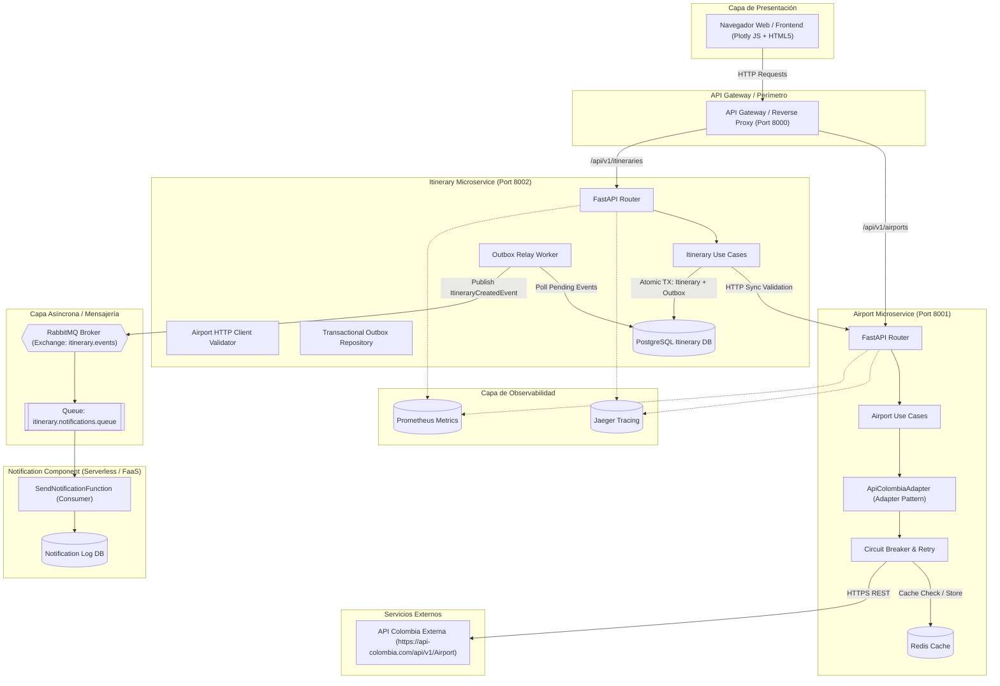
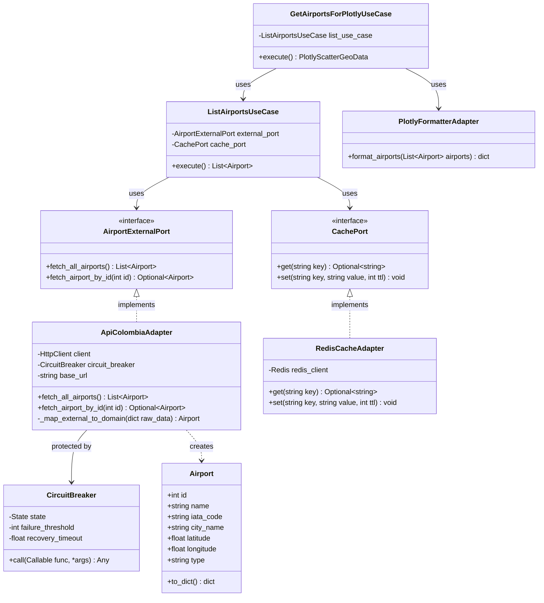
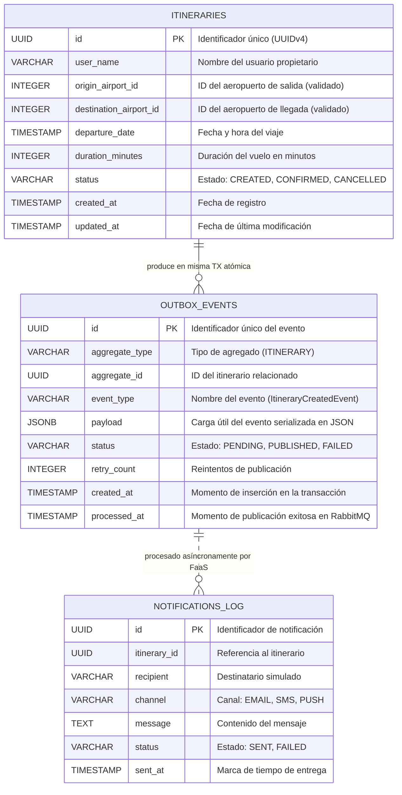
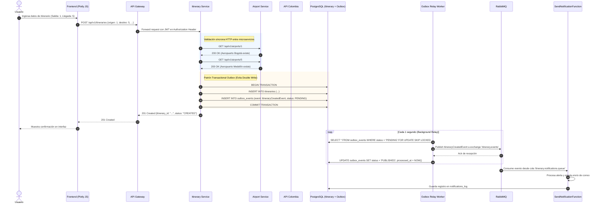

# PROMPT MAESTRO DE EJECUCIÓN: SISTEMA DISTRIBUIDO DE ITINERARIOS PERSONALES
> **Guía de Ejecución Integral y Plan de Trabajo Autónomo para el Asistente AI / Desarrollador**  
> **Basado en:** `Requerimientos taller.md` y Rúbrica Académica de Arquitectura de Software  
> **Objetivo:** Implementación completa, paso a paso y auditable del sistema de microservicios con resiliencia, arquitectura hexagonal, ciclo DevOps, Serverless, observabilidad y pruebas.

---

## ROL Y DIRECTIVA DE INICIO

Actúa como un **Lead Software Architect y Senior DevOps Engineer**. Tu objetivo es construir de principio a fin el sistema distribuido de itinerarios personales cumpliendo los 3 niveles de la rúbrica (Nivel 1 Base, Nivel 2 Avanzado y Nivel 3 Experto).

Debes ejecutar de manera metódica, limpia y validada cada una de las fases que se describen a continuación. No omitas ningún componente arquitectónico ni artefacto de ingeniería de software. Cada fase contiene sus especificaciones técnicas exactas, dependencias, contratos y criterios de aceptación.

---

## 1. MATRIZ DE ALINEACIÓN CON LA RÚBRICA Y REQUERIMIENTOS

| Requerimiento de Rúbrica | Nivel | Componente / Implementación |
| :--- | :--- | :--- |
| **Documento de Arquitectura Corto (SAD)** | Nivel 1 | Archivo `docs/architecture/SAD.md` con modelo 4+1, ADRs y principios de diseño. |
| **Microservicios (HTTP, Eventos)** | Nivel 1 & 2 | `airport-service` (HTTP), `itinerary-service` (HTTP + Eventos), `notification-service` (Event-driven). |
| **Arquitectura Hexagonal por servicio** | Nivel 1 | Estructura en capas desacopladas: Dominio (Core/Ports), Aplicación (Casos de Uso), Infraestructura (Adapters). |
| **Patrón Adapter Formal** | Nivel 1 | Puerto `AirportExternalPort` y adaptador `ApiColombiaAdapter` consumiendo API Colombia (`https://api-colombia.com/api/v1/Airport`). Adaptador para Plotly JS. |
| **Persistencia Relacional & Migraciones** | Nivel 1 | PostgreSQL / SQLite por microservicio con SQLAlchemy 2.0 y migraciones versionadas en Alembic. |
| **Documentación Swagger / OpenAPI** | Nivel 1 | Swagger interactivo funcional en `/docs` de cada microservicio y consolidado en el API Gateway. |
| **Ciclo DevOps Completo (Jira, Git, PRs)** | Nivel 1 & 3 | Backlog estructurado en Jira (historias Gherkin, story points), GitFlow / Trunk-based, plantillas PR, branch protections. |
| **Pruebas Unitarias** | Nivel 1 | Cobertura > 80% con `pytest` y `pytest-mock` aislando puertos y lógica de dominio. |
| **Pruebas de Carga** | Nivel 1 & 2 | Scripts de carga con `k6` y `locust` evaluando endpoints críticos y concurrencia. |
| **Pruebas en SonarQube** | Nivel 1 & 2 | Configuración `sonar-project.properties`, scripts de análisis local y control de Quality Gates. |
| **Despliegue Continuo (CI/CD)** | Nivel 2 & 3 | Pipeline en GitHub Actions (`.github/workflows/ci.yml`) con linting, test, SonarQube scan y Docker build. |
| **Dockerizado & Docker Compose por servicio** | Nivel 1 | Dockerfile multi-stage en cada servicio + `docker-compose.yml` por servicio y orquestador maestro raíz. |
| **Frontend con Plotly JS** | Nivel 1 | Interfaz web interactiva consumiendo aeropuertos adaptados y renderizando mapa geográfico Plotly JS. |
| **Resiliencia (Circuit Breaker, Retry, Redis)**| Nivel 2 | Circuit Breaker state machine (Closed/Open/Half-Open), exponential backoff con jitter y Redis cache con TTL. |
| **API Gateway / BFF & Seguridad JWT** | Nivel 2 | Gateway de enrutamiento con rate limiting y propagación de token JWT (S2S). |
| **Trazabilidad & Observabilidad** | Nivel 2 | OpenTelemetry + Jaeger para trazas distribuidas, logs estructurados JSON con `trace_id` y métricas Prometheus. |
| **Transactional Outbox & Double Write** | Nivel 3 | Patrón Outbox en `itinerary-service` con tabla de BD atómica y worker relé hacia RabbitMQ. |
| **AsyncAPI** | Nivel 2 | Especificación formal del contrato asíncrono en `docs/asyncapi.yaml`. |
| **Diseño Técnico (ER, Clases, Componentes)** | Nivel 1 | Diagramas técnicos completos en sintaxis Mermaid dentro de la documentación. |

---

## 2. ÁRBOL DE DIRECTORIOS OBJETIVO DEL PROYECTO

El proyecto se estructurará siguiendo un monorepositorio modular organizado por servicios independientes:

```text
Taller-Git-Prueba/
├── .github/
│   ├── workflows/
│   │   └── ci-cd.yml                 # Pipeline CI/CD GitHub Actions
│   └── pull_request_template.md      # Plantilla estándar para PRs
├── docs/
│   ├── architecture/
│   │   ├── SAD.md                    # Documento de Arquitectura de Software
│   │   ├── ADRs/                     # Architecture Decision Records
│   │   │   ├── ADR-001-fastapi-python.md
│   │   │   ├── ADR-002-hexagonal-architecture.md
│   │   │   ├── ADR-003-transactional-outbox.md
│   │   │   └── ADR-004-circuit-breaker.md
│   │   └── diagrams/                 # Diagramas técnicos (Mermaid/PlantUML)
│   ├── devops/
│   │   ├── jira_backlog.md           # Planificación de Sprint, Épicas e Historias de Jira
│   │   ├── git_workflow.md           # Estrategia de ramas, convenciones y release flow
│   │   └── sonarqube_setup.md        # Guía y reporte de análisis SonarQube
│   └── asyncapi.yaml                 # Contrato asíncrono de eventos de RabbitMQ
├── services/
│   ├── airport-service/              # Microservicio 1: Aeropuertos (Hexagonal + Adapter)
│   │   ├── src/
│   │   │   ├── domain/               # Entidades, Value Objects y Puertos
│   │   │   │   ├── models/airport.py
│   │   │   │   └── ports/
│   │   │   │       ├── external_airport_port.py
│   │   │   │       └── cache_port.py
│   │   │   ├── application/          # Casos de uso
│   │   │   │   ├── get_airport_by_id.py
│   │   │   │   ├── list_airports.py
│   │   │   │   └── get_airports_for_plotly.py
│   │   │   └── infrastructure/       # Adaptadores primarios y secundarios
│   │   │       ├── adapters/
│   │   │       │   ├── api_colombia_adapter.py    # PATRÓN ADAPTER formal
│   │   │       │   ├── plotly_adapter.py          # Adaptador de visualización
│   │   │       │   ├── redis_cache_adapter.py     # Cache Redis
│   │   │       │   └── circuit_breaker.py         # Resiliencia y fallback
│   │   │       ├── api/              # Controladores FastAPI
│   │   │       │   ├── router.py
│   │   │       │   └── schemas.py
│   │   │       └── config.py
│   │   ├── tests/
│   │   ├── Dockerfile
│   │   ├── docker-compose.yml
│   │   ├── sonar-project.properties
│   │   └── requirements.txt
│   ├── itinerary-service/            # Microservicio 2: Itinerarios (Hexagonal + Outbox)
│   │   ├── src/
│   │   │   ├── domain/
│   │   │   │   ├── models/itinerary.py
│   │   │   │   └── ports/
│   │   │   │       ├── itinerary_repository_port.py
│   │   │   │       ├── airport_validator_port.py
│   │   │   │       └── outbox_repository_port.py
│   │   │   ├── application/
│   │   │   │   ├── create_itinerary.py
│   │   │   │   ├── get_itinerary.py
│   │   │   │   └── list_itineraries.py
│   │   │   └── infrastructure/
│   │   │       ├── persistence/
│   │   │       │   ├── models.py      # SQLAlchemy (itineraries + outbox)
│   │   │       │   ├── sqlalchemy_itinerary_repo.py
│   │   │       │   └── alembic/       # Migraciones versionadas
│   │   │       ├── clients/
│   │   │       │   └── airport_http_validator.py  # Cliente HTTP resiliente
│   │   │       ├── messaging/
│   │   │       │   ├── rabbitmq_publisher.py
│   │   │       │   └── outbox_relay_worker.py     # Worker Transactional Outbox
│   │   │       ├── api/
│   │   │       └── config.py
│   │   ├── tests/
│   │   ├── Dockerfile
│   │   ├── docker-compose.yml
│   │   ├── sonar-project.properties
│   │   └── requirements.txt
│   ├── notification-service/         # Microservicio 3: Serverless / FaaS Event Consumer
│   │   ├── src/
│   │   │   ├── functions/
│   │   │   │   ├── send_notification_function.py # Función FaaS reactiva
│   │   │   │   └── generate_report_function.py
│   │   │   ├── consumers/
│   │   │   │   └── rabbitmq_event_consumer.py
│   │   │   ├── storage/
│   │   │   │   └── notification_repository.py
│   │   │   └── config.py
│   │   ├── tests/
│   │   ├── Dockerfile
│   │   ├── docker-compose.yml
│   │   └── requirements.txt
│   └── api-gateway/                  # API Gateway / Reverse Proxy & JWT Forwarding
│       ├── nginx.conf / gateway.py
│       ├── Dockerfile
│       └── docker-compose.yml
├── frontend/                         # Frontend con Mapa Plotly JS
│   ├── index.html
│   ├── style.css
│   ├── app.js                        # Lógica de consumo de API y renderizado Plotly
│   └── Dockerfile
├── tests/
│   ├── e2e/                          # Pruebas integrales de flujo completo
│   │   └── test_full_flow.py
│   ├── load/                         # Pruebas de carga
│   │   ├── k6_airports_load.js
│   │   ├── k6_itineraries_load.js
│   │   └── locustfile.py
│   └── chaos/                        # Pruebas de falla controlada (Circuit Breaker)
│       └── test_resilience_circuit_breaker.py
├── scripts/
│   ├── init_environment.sh / .ps1   # Arranque rápido
│   ├── run_tests.sh / .ps1          # Ejecución de unit tests con reporte
│   └── run_sonar_scan.sh / .ps1     # Análisis estático de código
├── docker-compose.yml                # Orquestador global con healthchecks y redes
├── sonar-project.properties          # Configuración SonarQube raíz
├── README.md                         # Documentación maestra y autoevaluación
└── Requerimientos taller.md
```

---

## 3. FASES DETALLADAS DE IMPLEMENTACIÓN (PLAN DE EJECUCIÓN)

---

### FASE 1: DISEÑO TÉCNICO Y DOCUMENTO DE ARQUITECTURA (SAD)

#### Objetivos
1. Crear el Documento de Arquitectura de Software (`docs/architecture/SAD.md`) basado en las directrices académicas (Modelo 4+1 adaptado y vistas arquitectónicas).
2. Generar diagramas formales en sintaxis Mermaid que se rendericen directamente en Markdown.
3. Documentar Contextos Delimitados (Bounded Contexts) y Lenguaje Ubicuo (DDD).

#### Especificaciones Técnicas y Diagramas Requeridos

##### 1.1 Diagrama de Componentes del Sistema


##### 1.2 Diagrama de Clases: Arquitectura Hexagonal y Patrón Adapter


##### 1.3 Diagrama Entidad-Relación (Base de Datos Relacional)


##### 1.4 Diagrama de Secuencia: Flujo Integral de Creación y Notificación Asíncrona


##### 1.5 Contextos Delimitados (Domain-Driven Design - DDD)
1. **Airport Catalog Context (Upstream - Open Host Service / Published Language):**
   - *Entidades clave:* `Airport`, `Runway`, `Coordinates`.
   - *Lenguaje Ubicuo:* Aeropuerto, IATA, Coordenadas Geográficas, Código OACI, Conectividad.
   - *Decisión de Agregado:* En el servicio de itinerarios, el Aeropuerto se maneja como una **Referencia de Valor (Value Object / External Identity)** únicamente validada por su ID, evitando la duplicación de datos maestros.
2. **Itinerary Management Context (Downstream - Customer/Supplier):**
   - *Entidades clave:* `Itinerary` (Agregado raíz), `TravelDate`, `FlightDuration`.
   - *Lenguaje Ubicuo:* Itinerario de viaje, Origen, Destino, Duración programada, Evento de Integración.
3. **Notification & Analytics Context (Downstream - Subscriber / FaaS):**
   - *Entidades clave:* `NotificationLog`, `DispatchChannel`, `NotificationTemplate`.
   - *Lenguaje Ubicuo:* Alerta de creación, Notificación al pasajero, Evento consumido.

---

### FASE 2: GESTIÓN DE PROYECTO Y CICLO DEVOPS (JIRA, GIT & CI/CD)

#### Objetivos
1. Crear el backlog en Markdown simulando la planeación ágil de **Jira** (`docs/devops/jira_backlog.md`).
2. Configurar la estrategia de ramas de Git (`docs/devops/git_workflow.md`), convención de commits y plantillas de Pull Request.
3. Crear el pipeline de integración continua con GitHub Actions (`.github/workflows/ci-cd.yml`).
4. Configurar **SonarQube** para análisis estático con reglas de Quality Gate.

#### Entregables y Archivos a Generar

##### 2.1 Backlog de Jira (`docs/devops/jira_backlog.md`)
Estructurar al menos 3 Épicas y 7 Historias de Usuario con formato estándar:
- **Épica 1: Catálogo de Aeropuertos y Visualización Geográfica (AIRP)**
  - *US-01:* Consumo y adaptación de API Colombia mediante patrón Adapter (Story Points: 5).
  - *US-02:* Resiliencia con Circuit Breaker y cache Redis en Airport Service (Story Points: 5).
  - *US-03:* Visualización interactiva en mapa geográfico usando Plotly JS (Story Points: 3).
- **Épica 2: Gestión de Itinerarios y Comunicación Asíncrona (ITIN)**
  - *US-04:* CRUD de itinerarios y validación HTTP con Airport Service (Story Points: 5).
  - *US-05:* Implementación de Transactional Outbox para evitar Double Write Problem (Story Points: 8).
- **Épica 3: Notificaciones Serverless y Observabilidad Distribuida (OPS)**
  - *US-06:* Procesamiento de notificaciones reactivas FaaS ante `ItineraryCreatedEvent` (Story Points: 3).
  - *US-07:* Trazabilidad distribuida con OpenTelemetry/Jaeger y logs estructurados (Story Points: 5).

*Cada historia de usuario debe incluir:*
- Formato: *Como [rol] quiero [funcionalidad] para [beneficio del negocio]*.
- Criterios de Aceptación escritos en sintaxis **Gherkin**:
  ```gherkin
  Escenario: Validación exitosa de aeropuertos antes de guardar itinerario
    Dado que el usuario envía una solicitud de itinerario con origen ID 1 y destino ID 5
    Cuando el servicio de itinerarios consulta al servicio de aeropuertos
    Entonces ambos aeropuertos son verificados como existentes
    Y el itinerario se persiste en la base de datos dentro de la misma transacción que el outbox
  ```

##### 2.2 Estrategia Git y Plantilla de Pull Request
- Estrategia: **GitFlow / GitHub Flow**.
  - `main`: Código productivo, tags de versión semántica (`v1.0.0`).
  - `develop`: Integración de características validadas.
  - `feature/<ticket-jira>-<descripcion-corta>`: Ramas de trabajo.
  - `fix/<ticket-jira>-<descripcion>`: Correcciones.
- Convención **Conventional Commits**:
  - `feat(airport): implement api colombia adapter with circuit breaker`
  - `fix(itinerary): resolve double write problem with transactional outbox`
  - `test(load): add k6 stress test for itinerary creation`
  - `docs(arch): add SAD 4+1 architecture view`
- Crear el archivo `.github/pull_request_template.md`:
  - Descripción del cambio.
  - Ticket de Jira asociado.
  - Tipo de cambio (feature, bugfix, refactor, docs).
  - Checklist: Pruebas unitarias pasan, análisis SonarQube sin errores, documentación actualizada, Swagger verificado.

##### 2.3 Pipeline CI/CD en GitHub Actions (`.github/workflows/ci-cd.yml`)
Configurar un workflow multi-job automatizado:
1. **Linting & Code Style:** Ejecución de `ruff` y `black --check`.
2. **Unit & Integration Tests:** Ejecución de `pytest` con reporte de cobertura XML (`coverage.xml`).
3. **SonarQube Scan:** Integración con `sonarsource/sonarqube-scan-action` enviando métricas y evaluando Quality Gate.
4. **Docker Build:** Construcción de imágenes Docker multi-stage para `airport-service`, `itinerary-service`, `notification-service`, `api-gateway` y `frontend`.
5. **Continuous Deployment (CD Preview):** Despliegue simulado / verificación de levantamiento vía `docker compose up -d` y healthcheck en runner.

##### 2.4 Configuración de SonarQube (`sonar-project.properties`)
Crear archivo de configuración con parámetros:
```properties
sonar.projectKey=sistema-itinerarios-personales
sonar.projectName=Sistema Distribuido de Itinerarios Personales
sonar.projectVersion=1.0.0
sonar.sources=services
sonar.tests=tests
sonar.python.coverage.reportPaths=coverage.xml
sonar.sourceEncoding=UTF-8
sonar.exclusions=**/alembic/**,**/tests/**,**/venv/**
sonar.qualitygate.wait=true
```

---

### FASE 3: MICROSERVICIO DE AEROPUERTOS (`airport-service`)

#### Objetivos
1. Implementar la Arquitectura Hexagonal estricta (Dominio, Aplicación, Infraestructura).
2. Desarrollar el **Patrón Adapter** formal desacoplando el dominio de la API Colombia externa.
3. Incorporar resiliencia avanzada: **Circuit Breaker** (máquina de estados), **Retry con Exponential Backoff** y **Redis Cache**.
4. Formatear y exponer datos optimizados para Plotly JS.
5. Exponer API REST documentada en Swagger en `/docs`.
6. Crear Dockerfile multi-stage y `docker-compose.yml` individual con Redis.

#### Especificación de Archivos y Componentes

##### 3.1 Dominio y Puertos (`services/airport-service/src/domain/`)
- `models/airport.py`:
  - Modelo inmutable Pydantic / Dataclass: `id: int`, `name: str`, `iata_code: str`, `city: str`, `department: str`, `latitude: float`, `longitude: float`, `type: str`.
- `ports/external_airport_port.py`:
  - Interfaz abstracta (`ABC`):
    ```python
    from abc import ABC, abstractmethod
    from typing import List, Optional
    from src.domain.models.airport import Airport

    class ExternalAirportPort(ABC):
        @abstractmethod
        async def get_all_airports(self) -> List[Airport]:
            pass

        @abstractmethod
        async def get_airport_by_id(self, airport_id: int) -> Optional[Airport]:
            pass
    ```
- `ports/cache_port.py`:
  - Interfaz abstracta para cache: `get(key: str)`, `set(key: str, value: str, ttl_seconds: int)`.

##### 3.2 Infraestructura: Adaptador Formal de API Colombia (`ApiColombiaAdapter`)
- Archivo: `services/airport-service/src/infrastructure/adapters/api_colombia_adapter.py`.
- Consumo de `https://api-colombia.com/api/v1/Airport`.
- Mapeo del JSON crudo de API Colombia al modelo `Airport` del dominio interno.
- Implementación de **Circuit Breaker**:
  - Estado `CLOSED`: Las peticiones pasan normalmente.
  - Estado `OPEN`: Si ocurren 3 fallas consecutivas o timeouts (> 3s), el circuito se abre y lanza fallback inmediato sin contactar la API externa por 30 segundos.
  - Estado `HALF-OPEN`: Pasados los 30 segundos, permite 1 petición de prueba; si es exitosa, se cierra el circuito; si falla, vuelve a `OPEN`.
- Implementación de **Retry con Exponential Backoff**:
  - Reintentos: 3 intentos con factor base de 0.5s y jitter aleatorio para prevenir avalanchas.
- Integración con `RedisCacheAdapter`:
  - Cacheo de la lista completa con TTL de 3600 segundos (1 hora).

##### 3.3 Aplicación: Casos de Uso y Adaptador Plotly
- `application/list_airports.py`: Recupera de cache o consulta al adapter externo.
- `application/get_airport_by_id.py`: Valida si existe un aeropuerto específico.
- `application/get_airports_for_plotly.py` & `infrastructure/adapters/plotly_adapter.py`:
  - Transforma los objetos de dominio `Airport` en la estructura exacta de datos que espera Plotly:
    ```json
    {
      "type": "scattergeo",
      "mode": "markers+text",
      "lat": [4.7016, 6.1645, ...],
      "lon": [-74.1469, -75.4231, ...],
      "text": ["BOG - El Dorado", "MDE - José María Córdova", ...],
      "ids": [1, 5, ...],
      "marker": { "size": 8, "color": "#1f77b4" }
    }
    ```

##### 3.4 API FastAPI y Swagger (`infrastructure/api/`)
- Endpoints:
  - `GET /api/v1/airports`: Lista de todos los aeropuertos (formato dominio).
  - `GET /api/v1/airports/{id}`: Información detallada de un aeropuerto específico (usado por `itinerary-service`).
  - `GET /api/v1/airports/map/plotly`: Datos listos para inyectar en `Plotly.newPlot()`.
  - `GET /health`: Healthcheck (evalúa conexión a Redis y estado del Circuit Breaker).
  - `/docs`: Documentación Swagger interactiva autogenerada con códigos de estado (200, 404, 500, 503).

---

### FASE 4: MICROSERVICIO DE ITINERARIOS (`itinerary-service`)

#### Objetivos
1. Arquitectura Hexagonal con base de datos relacional independiente (PostgreSQL).
2. CRUD completo de itinerarios con Pydantic y SQLAlchemy 2.0.
3. Migraciones versionadas de esquema de base de datos con **Alembic**.
4. Validación síncrona HTTP contra `airport-service` para asegurar existencia de aeropuertos de origen y destino.
5. Patrón **Transactional Outbox** para publicar eventos de dominio garantizando consistencia y resolviendo el **Double Write Problem**.
6. Proceso Worker de relé (`outbox_relay_worker.py`) que despacha a **RabbitMQ**.

#### Especificación de Archivos y Componentes

##### 4.1 Dominio y Puertos (`services/itinerary-service/src/domain/`)
- `models/itinerary.py`:
  - Entidad: `id: UUID`, `user_name: str`, `origin_airport_id: int`, `destination_airport_id: int`, `departure_date: datetime`, `duration_minutes: int`, `status: str`.
- `ports/itinerary_repository_port.py`:
  - `save(itinerary: Itinerary, outbox_event: OutboxEvent) -> Itinerary` (Ejecutado atómicamente).
  - `find_by_id(itinerary_id: UUID) -> Optional[Itinerary]`
  - `list_all() -> List[Itinerary]`
  - `delete(itinerary_id: UUID) -> bool`
- `ports/airport_validator_port.py`:
  - `validate_airport_exists(airport_id: int) -> bool`

##### 4.2 Infraestructura: Persistencia y Alembic
- Tablas SQLAlchemy en `models.py`:
  - `itineraries`: Campos id, user_name, origin_airport_id, destination_airport_id, departure_date, duration_minutes, status, created_at.
  - `outbox_events`: Campos id, aggregate_type, aggregate_id, event_type, payload (JSON), status (`PENDING`, `PUBLISHED`, `FAILED`), retry_count, created_at, processed_at.
- Configuración de Alembic: Directorio `alembic/` con migración inicial `001_initial_schema.py`.

##### 4.3 Validación HTTP de Aeropuertos (`AirportHttpClient`)
- Cliente HTTP (`httpx.AsyncClient`) con timeout de 3 segundos y retry.
- Consulta `GET http://airport-service:8001/api/v1/airports/{id}`.
- Si el aeropuerto de origen o destino no existe, rechaza la creación arrojando un error HTTP `400 Bad Request` o `422 Unprocessable Entity` con mensaje explícito.

##### 4.4 Patrón Transactional Outbox y Worker de Publicación
1. **Escritura Atómica:** El caso de uso `CreateItineraryUseCase` abre una transacción con PostgreSQL:
   - Inserta el itinerario en la tabla `itineraries`.
   - Inserta el evento `ItineraryCreatedEvent` en la tabla `outbox_events` con `status = 'PENDING'`.
   - Realiza `commit()`. Si algo falla, se hace rollback y no hay inconsistencia.
2. **Outbox Relay Worker (`outbox_relay_worker.py`):**
   - Tarea en segundo plano (coroutine o proceso independiente).
   - Consulta registros en `outbox_events` con estado `PENDING`.
   - Publica el mensaje en formato JSON a RabbitMQ:
     - Exchange: `itinerary.events` (tipo Topic o Direct).
     - Routing Key: `itinerary.created`.
   - Al recibir confirmación del broker (RabbitMQ Publisher Confirms), actualiza el registro en la BD a `status = 'PUBLISHED'` con `processed_at = datetime.utcnow()`.

##### 4.5 Endpoints FastAPI y Swagger
- `POST /api/v1/itineraries`: Crea y valida itinerario (201 Created).
- `GET /api/v1/itineraries`: Lista itinerarios creados (200 OK).
- `GET /api/v1/itineraries/{id}`: Detalle de itinerario por ID (200 OK / 404 Not Found).
- `DELETE /api/v1/itineraries/{id}`: Elimina itinerario (204 No Content).
- `GET /health`: Healthcheck de base de datos y worker.

---

### FASE 5: COMPONENTE SERVERLESS / FaaS (`notification-service`)

#### Objetivos
1. Implementar la arquitectura **Serverless / Function-as-a-Service (FaaS)** para procesamiento de notificaciones asíncronas.
2. Crear la función reactiva `SendNotificationFunction` que se activa únicamente ante la llegada de `ItineraryCreatedEvent` desde RabbitMQ.
3. Registrar la auditoría de notificaciones en base de datos dedicada.
4. Documentar el contrato asíncrono formal mediante **AsyncAPI** (`docs/asyncapi.yaml`).

#### Especificación de Archivos y Componentes

##### 5.1 Función FaaS Reactiva (`SendNotificationFunction`)
- Se suscribe a la cola `itinerary.notifications.queue` atada al exchange `itinerary.events`.
- Carga útil esperada (`payload`):
  ```json
  {
    "event_id": "c56a4180-65aa-42ec-a945-5fd21dec0538",
    "event_type": "ItineraryCreatedEvent",
    "timestamp": "2026-09-20T22:30:00Z",
    "data": {
      "itinerary_id": "3fa85f64-5717-4562-b3fc-2c963f66afa6",
      "user_name": "Juan Perez",
      "origin_airport_id": 1,
      "destination_airport_id": 5,
      "departure_date": "2026-10-15T08:00:00Z",
      "duration_minutes": 55
    }
  }
  ```
- Lógica de la función:
  - Parsea y valida el evento.
  - Simula el envío de una notificación (correo de confirmación con detalles del vuelo).
  - Almacena el registro en la base de datos de auditoría (`notifications_log`).
  - Emite logs estructurados en JSON con el `trace_id` original propagado en las cabeceras AMQP.

##### 5.2 Contrato AsyncAPI (`docs/asyncapi.yaml`)
Especificación YAML formal que incluye:
- Versión de AsyncAPI: 2.6.0.
- Servidor: RabbitMQ (protocolo AMQP 0-9-1).
- Canales: `itinerary/created`.
- Mensaje: `ItineraryCreatedEvent` con schema JSON de validación.

---

### FASE 6: API GATEWAY, SEGURIDAD Y OBSERVABILIDAD DISTRIBUIDA

#### Objetivos
1. Configurar un **API Gateway** unificado como punto único de entrada del sistema.
2. Implementar control de flujo (Rate Limiting) y propagación de cabeceras de autenticación JWT.
3. Instrumentar trazabilidad distribuida con **OpenTelemetry** y visualizador **Jaeger**.
4. Estandarizar logs estructurados en JSON en todos los microservicios con correlation IDs (`trace_id` y `span_id`).

#### Especificaciones Técnicas

##### 6.1 API Gateway
- Tecnologías: FastAPI Reverse Proxy o Nginx.
- Enrutamiento:
  - `/api/v1/airports/*` $\rightarrow$ `http://airport-service:8001/api/v1/airports/*`
  - `/api/v1/itineraries/*` $\rightarrow$ `http://itinerary-service:8002/api/v1/itineraries/*`
  - `/` $\rightarrow$ Servidor estático del Frontend.
- Rate Limiting: Máximo 60 peticiones por minuto por dirección IP.
- Propagación de Seguridad: Inspecciona y propaga `Authorization: Bearer <token>` a los servicios downstream.

##### 6.2 Observabilidad con OpenTelemetry & Jaeger
- En cada servicio, configurar `opentelemetry-instrumentation-fastapi`, `opentelemetry-instrumentation-httpx` y `opentelemetry-exporter-otlp-proto-grpc`.
- Las trazas se envían al contenedor de **Jaeger** (`jaeger:4317`).
- Permite visualizar en la UI de Jaeger (`http://localhost:16686`) el ciclo de vida completo de un request desde el Frontend/Gateway, pasando por `itinerary-service`, llamando a `airport-service` y publicando en RabbitMQ.

##### 6.3 Logs Estructurados JSON
Configuración de logging unificada (`python-json-logger`) para emitir en stdout:
```json
{
  "timestamp": "2026-09-20T22:35:10.123Z",
  "level": "INFO",
  "service": "itinerary-service",
  "trace_id": "4bf92f3577b34da6a3ce929d0e0e4736",
  "span_id": "00f067aa0ba902b7",
  "message": "Itinerary created successfully and queued in transactional outbox",
  "itinerary_id": "3fa85f64-5717-4562-b3fc-2c963f66afa6"
}
```

---

### FASE 7: FRONTEND INTERACTIVO CON PLOTLY JS

#### Objetivos
1. Modernizar los archivos del frontend existente (`index.html`, `style.css`) reemplazando Leaflet por **Plotly JS**.
2. Renderizar el mapa geográfico de Colombia mostrando la ubicación de los aeropuertos obtenidos desde `airport-service` (vía Gateway).
3. Conectar el formulario de itinerarios para crear nuevos registros consumiendo `itinerary-service`.
4. Mostrar alertas en vivo y tabla reactiva con los itinerarios existentes y su estado.

#### Especificación de Implementación
- Modificar `index.html` e incluir `<script src="https://cdn.plot.ly/plotly-2.27.0.min.js"></script>`.
- Crear `frontend/app.js`:
  - `loadAirportsMap()`: Realiza `fetch('/api/v1/airports/map/plotly')` y ejecuta:
    ```javascript
    Plotly.newPlot('map', data.data, data.layout, { responsive: true });
    ```
  - Poblar selects interactivos para "Aeropuerto de Salida" y "Aeropuerto de Llegada" con los aeropuertos reales de Colombia (Nombre + IATA).
  - Manejador de evento submit: Envía `POST /api/v1/itineraries` con JSON estructurado.
  - Al recibir 201 Created, actualiza la lista dinámica de itinerarios en la interfaz.

---

### FASE 8: SUITE DE PRUEBAS (UNITARIAS, CARGA Y RESILIENCIA)

#### Objetivos
1. Crear pruebas unitarias con `pytest` y mocks para alcanzar más del 80% de cobertura.
2. Desarrollar scripts de pruebas de carga con **k6** y **Locust**.
3. Implementar una prueba automatizada de demostración de resiliencia del **Circuit Breaker** (simulando caída de API Colombia).

#### Especificaciones Técnicas

##### 8.1 Pruebas Unitarias (`pytest`)
- `tests/unit/test_api_colombia_adapter.py`: Verifica la traducción correcta del JSON externo al modelo `Airport` y el manejo de respuestas nulas o erróneas.
- `tests/unit/test_circuit_breaker.py`: Verifica que el estado cambia a `OPEN` tras 3 fallos y ejecuta el fallback.
- `tests/unit/test_itinerary_usecases.py`: Prueba la creación de itinerarios mockeando el validador HTTP de aeropuertos y el repositorio outbox.
- `tests/unit/test_notification_consumer.py`: Prueba la función serverless de notificación.

##### 8.2 Pruebas de Carga con k6 (`tests/load/k6_airports_load.js`)
Configuración de escenario de carga:
```javascript
import http from 'k6/http';
import { check, sleep } from 'k6';

export const options = {
  stages: [
    { duration: '30s', target: 20 },  // Rampa a 20 usuarios
    { duration: '1m', target: 50 },   // Mantener 50 usuarios concurrentes
    { duration: '20s', target: 0 },   // Rampa descendente
  ],
  thresholds: {
    http_req_duration: ['p(95)<200'], // 95% de las peticiones deben responder en menos de 200ms (Cache Redis)
    http_req_failed: ['rate<0.01'],   // Menos del 1% de error
  },
};

export default function () {
  const res = http.get('http://localhost:8000/api/v1/airports');
  check(res, { 'status is 200': (r) => r.status === 200 });
  sleep(1);
}
```

##### 8.3 Demostración de Resiliencia y Falla Controlada (`tests/chaos/`)
- Script `test_resilience_circuit_breaker.py`:
  - Simula la caída de la API externa (o usa un endpoint dummy con timeout).
  - Envía solicitudes consecutivas y comprueba:
    1. Las primeras solicitudes fallan o agotan el timeout.
    2. El Circuit Breaker cambia su estado a `OPEN`.
    3. Las siguientes solicitudes responden de inmediato con fallback o error controlado (`503 Service Unavailable` / datos cacheados en Redis) en menos de 5ms, sin saturar la red ni bloquear hilos.

---

### FASE 9: DOCKERIZACIÓN Y ORQUESTACIÓN GLOBAL

#### Objetivos
1. Crear Dockerfiles multi-stage optimizados para cada servicio.
2. Crear un archivo `docker-compose.yml` por cada servicio para desarrollo independiente.
3. Crear el archivo `docker-compose.yml` raíz que orqueste todos los componentes con dependencias y healthchecks saludables (`service_healthy`).

#### Especificación del `docker-compose.yml` Raíz
Servicios a orquestar:
1. `api-gateway` (Puerto 8000:8000).
2. `airport-service` (Puerto 8001:8001).
3. `itinerary-service` (Puerto 8002:8002).
4. `notification-service` (Worker consumidor FaaS).
5. `postgres-itinerary` (Puerto 5432:5432, base de datos relacional para itinerarios y outbox).
6. `redis` (Puerto 6379:6379, cache de aeropuertos).
7. `rabbitmq` (Puertos 5672:5672 para AMQP y 15672:15672 para Dashboard de Administración).
8. `jaeger` (Puertos 16686:16686 para UI y 4317:4317 para OTLP).
9. Redes aisladas: `frontend-net`, `backend-net`, `data-net`.
10. Volúmenes nombrados para persistencia de PostgreSQL y RabbitMQ.

---

### FASE 10: DOCUMENTACIÓN MAESTRA Y AUTOEVALUACIÓN

#### Objetivos
1. Actualizar el archivo `README.md` maestro del repositorio con toda la información solicitada en el apartado de **Entregables** de `Requerimientos taller.md`.
2. Completar la **Tabla de Autoevaluación** justificando el cumplimiento de cada nivel de la rúbrica.

#### Estructura Requerida en `README.md`
1. **Descripción General del Proyecto:** Propósito y tecnologías empleadas.
2. **Diagramas de Arquitectura:**
   - Diagrama de Componentes.
   - Diagrama de Clases (Arquitectura Hexagonal + Adapter).
   - Diagrama Entidad-Relación.
   - Diagrama de Secuencia.
   - Diagrama de Despliegue.
3. **Decisiones de Diseño y DDD:**
   - Contextos Delimitados y Lenguaje Ubicuo.
   - Decisión sobre el Agregado Aeropuerto (Referencia de Valor externa).
   - Eventos de Dominio vs. Eventos de Integración.
   - Explicación del Patrón Adapter implementado para API Colombia y Plotly.
   - Explicación de la solución al Double Write Problem con Transactional Outbox.
4. **Instrucciones de Ejecución:**
   - Prerrequisitos (Docker, Docker Compose, Python 3.11).
   - Comando único de arranque: `docker compose up --build -d`.
   - URLs de acceso: Frontend (`http://localhost:8000`), Swagger Airport (`http://localhost:8001/docs`), Swagger Itinerary (`http://localhost:8002/docs`), RabbitMQ Admin (`http://localhost:15672`), Jaeger Tracing (`http://localhost:16686`).
5. **Guía de Pruebas y Evidencias:**
   - Cómo ejecutar los tests unitarios (`pytest`).
   - Cómo ejecutar las pruebas de carga (`k6` / `locust`).
   - Cómo reproducir la prueba de falla controlada del Circuit Breaker.
6. **Tabla de Autoevaluación Detallada:** Justificación de cada ítem de Nivel 1, Nivel 2 y Nivel 3.

---

## 4. INSTRUCCIONES DE EJECUCIÓN PASO A PASO (PROMPT DE ACCIÓN PARA EL AGENTE)

Cuando recibas la instrucción de **"EJECUTAR PLAN"**, deberás proceder estrictamente en este orden:

```text
PASO 1: Generar la estructura de carpetas completa del proyecto (docs, services, tests, scripts, etc.).
PASO 2: Redactar los documentos de diseño técnico y arquitectura (docs/architecture/SAD.md y docs/devops/jira_backlog.md).
PASO 3: Construir el microservicio 'airport-service' completo (Hexagonal, Adapter API Colombia, Circuit Breaker, Redis, Plotly Adapter, tests y Dockerfile).
PASO 4: Construir el microservicio 'itinerary-service' completo (Hexagonal, CRUD, validación HTTP, Transactional Outbox, SQLAlchemy, Alembic, tests y Dockerfile).
PASO 5: Construir el servicio serverless 'notification-service' (Consumidor RabbitMQ, SendNotificationFunction, AsyncAPI y Dockerfile).
PASO 6: Implementar el API Gateway (enrutamiento, rate limit, seguridad) y la observabilidad (OpenTelemetry + Jaeger + logs JSON).
PASO 7: Modificar el frontend para usar Plotly JS consumiendo los microservicios a través del Gateway.
PASO 8: Configurar los archivos de CI/CD (.github/workflows/ci-cd.yml), SonarQube (sonar-project.properties) y scripts de automatización.
PASO 9: Implementar la suite de pruebas unitarias, de carga (k6) y de resiliencia (falla controlada de circuit breaker).
PASO 10: Ensamblar el docker-compose.yml maestro y redactar el README.md final con toda la documentación y tabla de autoevaluación.
```

---
*Fin del documento de planificación maestra. Este archivo es autoinclusivo y servirá como prompt de referencia para la construcción automatizada del sistema.*
